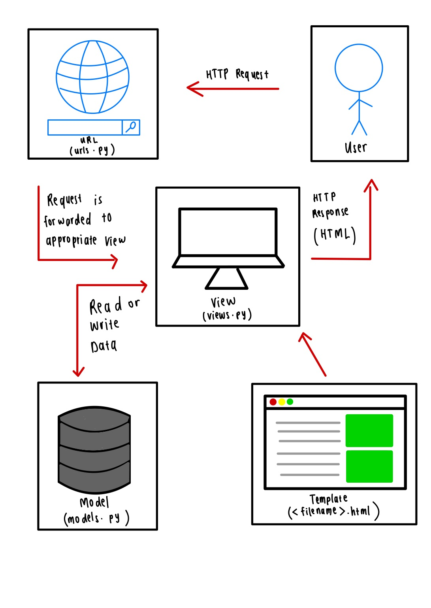

Nama    : Fathirahma Alyssa Pristanti
NPM     : 2206082215
Kelas   : PBP-F

# Adaptable Link
https://inventory-management.adaptable.app

# Tugas 2
# Jawaban Pertanyaan
1. **Implementasi Checklist**
    >> Membuat proyek baru di Django

        - Membuat direktori lokal dengan nama inventory_management

        - Melakukan cd pada terminal

        - Menginisiasi repository baru pada git dengan git init

        - Membuka direktori lokal pada IDE (Visual Studio Code)

        - Membuat berkas README.md

        - Melakukan perintah git add dan git commit pada terminal

        - Mengaktifkan virtual environment pada terminal

        - Membuat file requirements.txt yang berisi package/dependencies yang dibutuhkan

        - Melakukan instalasi package dengan perintah pip install -r requirements.txt pada terminal

        - Membuat proyek django dengan nama inventory_management dengan perintah django-admin startproject inventory_management

    >> Membuat aplikasi dengan nama main pada proyek tersebut

        - Membuka terminal dan melakukan cd pada direktori utama, yaitu inventory_management

        - Mengaktifkan virtual environment

        - Melakukan perintah python3 manage.py startapp main

    >> Melakukan routing pada proyek agar dapat menjalankan aplikasi main

        - Menambahkan 'main' pada INSTALLED_APPS yang ada di berkas settings.py

    >> Membuat model pada aplikasi main dengan nama Item dan memiliki atribut wajib (name dengan tipe CharField, amount dengan tipe IntegerField, description dengan tipe TextField)

        - Membuat Class bernama Item

        - Menambahkan beberapa atribut

            - Atribut Wajib:

                1. name dengan tipe CharField

                2. amount dengan tipe IntegerField

                3. description dengan tipe TextField

            - Atribut tambahan:

                1. category dengan tipe CharField

    >> Membuat fungsi views.py untuk dikembalikan ke dalam sebuah template HTML yang menampilkan nama aplikasi serta nama dan kelas.

        - Membuat def show_main yang menerima parameter request

        - Membuat context yang merupakan dictionary data yang akan dikirimkan ke Views yang terdiri atas:

            1. application_name yang merupakan nama aplikasi

            2. name yang berisi data nama

            3. class yang berisi data kelas

        - Melakukan render tampilan dengan return render(request, "main.html", context)

    >> Membuat sebuah routing pada urls.py aplikasi main untuk memetakan fungsi yang telah dibuat pada views.py

        - Menambahkan path('', include('main.urls')) pada berkas urls.py yang ada di dalam folder project

        - Menambahkan path('', show_main, name='show_main') pada berkas urls.py yang ada di dalam aplikasi main

    >> Melakukan deployment ke Adaptable

        - Melakukan perintah git add, git commit, dan git push pada terminal

        - Membuat New App pada Adaptable kemudian memilih repository proyek inventory_management sebagai basis aplikasi akun yang akan di-deploy

        - Memilih Python App Template sebagai template deployment

        - Memilih PostgreSQL sebagai basis data yang digunakan

        - Menyesuaikan versi Python yang digunakan

        - Memasukkan perintah python manage.py migrate && gunicorn inventory_management.wsgi pada bagian Start Command

        - Memasukkan nama aplikasi, yaitu inventory-management

        - Mencentang HTTP Listener on PORT kemudian melakukan deploy

        - Menyalin nama domain untuk dimasukkan ke berkas README.md
        
    >> Membuat sebuah README.md yang berisi tautan menuju aplikasi Adaptable yang sudah di-deploy, serta jawaban dari beberapa pertanyaan berikut.

        - Menjawab pertanyaan pada berkas README.md
        
2. **Bagan Request Client dan Penjelasannya**
    
    Alur request client ke web aplikasi berbasis Django adalah pertama client akan mengakses URL yang didefinisikan di dalam urls.py. Kemudian, permintaan tersebut diarahkan ke fungsi-fungsi yang sesuai dalam views.py. Fungsi-fungsi tersebut kemudian mengambil atau mengakses data yang didefinisikan di dalam models.py, dan kemudian hasilnya akan dikirim kepada client melalui berkas HTML yang telah dirancang dengan baik.

3. **Alasan menggunakan Virtual Environment dan Apakah bisa membuat aplikasi berbasis Django tanpa Virtual Environment**
    Virtual environment dibutuhkan untuk menghasilkan beberapa proyek Django dalam suatu sistem yang membutuhkan package/dependensi dan versi Python yang berbeda. Dengan adanya virtual environment, dapat mencegah terjadinya konflik dependensi di antara proyek-proyek tersebut. Kita tetap dapat membuat aplikasi web berbasis Django tanpa menggunakan virtual environment. Namun, hal tersebut tidak disarankan karena dapat menimbulkan masalah dengan dependensi proyek dan konflik dengan proyek lain. 
4. **Perbedaan MVC, MVT, dan MVVM**
    >> MVC
    1. Model: Model merepresentasikan sebuah objek yang membawa data. Model dapat memiliki logic untuk melakukan _update_ controller apabila data berubah. Namun, model tidak memiliki logic untuk menyajikan data kepada user.
    2. View: View merepresentasikan visualisasi dari data yang dimiliki oleh model. View dapat mengakses data yang dimiliki model, namun tidak mengerti apa kegunaan dari data tersebut.
    3. Controller: Controller mengatur _flow_ data dari model dan melakukan _update_ view ketika data berubah. Controller mengatur agar model dan view terpisah.

    >> MVT
    1. Model: Model membantu untuk menangani _databases_. Model merupakan _access data layer_ yang mengandung beberapa _fields_ dan _behaviors_ dari data yang disimpan. Model membantu _developers_ untuk melakukan CRUD (_create, read, update, and delete_) objek
    2. View: View digunakan untuk mengeksekusi _business logic_ dan berinterkasi secara langsung dengan Model untuk membawa data dan melakukan _render_ dari template. View mengambil data dari model. Kemudian, View dapat memberikan akses kepada template untuk mengakses data tersebut atau memprosesnya sendiri. View menerima request dari Client, mengaplkasikan _business logic_, dan menyajikan response HTTP kepada Client.
    3. Template: Template merupakan sebuah _layer_ yang dapat menangani User Interface. Template berisi HTML _code_ yang digunakan untuk me-_render_ data. Kode di template dapat berupa statis atau dinamis. Template hanya digunakan untuk menyajikan data, tidak ada _business logic_ di sini

    >> MVVM
    1. Model: Model merepresentasikan domain dari sebuah aplikasi yang terdiri atas model data, _business and validation logic_
    2. View: View merepresentasikan sebuah _user interface_ dari sebuah aplikasi yang mengimplementasikan visual. View tidak berisi data-data dan tidak dapat juga memanipulasi data-data tersebut.
    3. ViewModel: ViewModel menghubungkan antara View dan Model. ViewModel mengimplementasi dan juga menghubungkan _public properties_ dan _command_ yang digunakan View menggunakan _data binding_. Apabila terjadi perubahan, View akan menotifikasi View dengan sebuah _event_

    >> Perbedaan ketiga design pattern
    MVC digunakan untuk mengembangkan sistem perangkat lunak. Namun, MVT adalah MVC yang secara spesifik digunakan untuk pengembangan proyek Django. Kemudian, MVVM digunakan untuk pengembangan aplikasi yang berfokus pada User Interface (UI)

# Tugas 3
# Jawaban Pertanyaan
1. **Perbedaan form Post dan Get**
    >>POST
    Post mengemas data dari forms, mengkodekannya untuk proses transmisi, mengirimkannya ke server, dan kemudian menerima responsnya.

    >>GET
    GET mengemas data yang dikirimkan ke dalam bentuk String dan menggunakannya untuk membuat URL. URL tersebut akan berisi data yang harus dikirimkan, serta key dan value dari data tersebut.
    
    GET dan POST biasanya digunakan untuk tujuan yang berbeda. Request yang sifatnya mengubah status sistem serta membuat perubahan dalam database lebih cocok untuk menggunakan POST dibandingkan dengan GET. Selain itu, POST juga cocok digunakan untuk memproses data yang jumlahnya besar atau dalam bentuk binary data, seperti gambar. Aplikasi yang menggunakan GET lebih rentan dari segi security karena akan memberikan akses ke bagian sensitif dari sistem. POST dikombinasikan dengan sistem keamanan seperti perlindungan CSRF Django sehingga memberikan kontrol terhadap akses dari sistem. Di sisi lain, GET cocok untuk hal-hal seperti web search form karena URL yang merepresentasikan GET dapat dengan mudah ditandai, disimpan, dan dikirim ulang.
2. **Perbedaan antara XML, JSON, dan HTML**
    >>XML
    XML adalah sebuah markup language dan format file yang digunakan untuk menyimpan, mengirim, dan merekonstruksi sebuah data. XML mendefinisikan sejumlah aturan untuk mengkodekan dokumen dalam format yang dapat dibaca oleh manusia dan mesin. XML telah umum digunakan untuk proses pertukaran data melalui Internet. Pada web app, XML digunakan untuk menyimpan atau melakukan pertukaran data. Data-data dalam XML bersifat self-descriptive sehingga dengan membaca XML manusia dapat mengerti informasi apa yang ingin disampaikan.

    >>JSON
    JSON adalah sebuah format file dan format pertukaran data yang menggunakan teks yang mudah dibaca oleh manusia untuk menyimpan dan mengirim objek yang terdiri atas atribut-atribut. JSON adalah format data yang umum digunakan dalam aplikasi web dan server. JSON umumnya digunakan untuk meng-serialisasi dan mengirimkan data melalui koneksi jaringan seperti internet. JSON digunakan terutama untuk mengirimkan data antara server dan aplikasi web. JSON dapat mengelola berbagai jenis data seperti String, Numbers, Booleans, Null, Arrays, dan Objects. JSON bersifat self-describing, sehingga JSON sangat mudah untuk dimengerti.

    >>HTML
    HTML adalah sebuah markup language yang digunakan oleh web untuk menginterpretasikan dan menyusun teks, gambar, dan materi lainnya menjadi sebuah halaman web. HTML terdiri atas beberapa komponen (atribut), jenis data berbasis karakter, referensi karakter, dan referensi entitas. Tag HTMl yang paling umum yaitu tag awal yang menandai awal elemen dan sering memiliki atribut yang mendefinisikan sifat elemen tersebut, contohnya adalah 
 untuk paragraf dan tag akhir yang menandai akhir elemen dan biasanya mirip dengan tag awal, tetapi dengan tanda "/" sebelum nama elemen, contohnya adalah 
 untuk menutup paragraf.

    Pada dasarnya, JSON dan XML adalah metode untuk menyimpan dan mentransfer data, sedangkan HTML adalah metode untuk menjelaskan bagaimana data ini harus ditampilkan di perangkat pengguna. Baik JSON maupun XML memiliki kelebihan dan kekurangan masing-masing; JSON lebih ringkas dibandingkan XML, tetapi XML lebih fleksibel dan aman.

3. **Alasan JSON sering digunakan dalam pertukaran data antara aplikasi web modern?**
    JSON sering digunakan dalam pertukaran data karena beberapa alasan. Pertama, JSON bersifat native bagi JavaScript dan biasanya digunakan di dalam JavaScript program sebagai literal. Selain itu, JSON juga dapat digunakan dalam bahasa pemrograman lain sehingga bersifat heterogen. Terakhir, JSON sangat mudah dibaca oleh manusia. Sebagai sebuah struktur data bahasa (language data structure), JSON sangat serbaguna. Penggunaan JSON cukup mudah jika dibandingkan dengan format lainnya.
4. **Implementasi Checklist**
    >> Membuat input form untuk menambahkan objek model pada app sebelumnya

        - Membuat berkas file forms.py pada direktori main kemudian membuat struktur form yang akan menerima data dari produk baru. Kemudian data dari form tersebut akan disimpan dalam objek Item

        - Menambahkan fields dari Product yang terdiri atas name, amount, description, dan category

    >> Menambahkan 5 fungsi views untuk melihat objek yang sudah ditambahkan dalam format HTML, XML, JSON, XML by ID, dan JSON by ID

        > Melihat objek dalam format HTML

            - Membuka berkas views.py pada direktori main kemudian melakukan import HTTPResponseDirect, import Item dari main.models, dan import ProductForm dari forms.py

            - Membuat sebuah fungsi bernama create_new_product yang akan menerima request dari client sebagai parameter kemudian menambahkan kode apabila form valid dan apabila request method menggunakan POST maka data akan ditambahkan secara otomatis saat client men-submit form

            - Mengubah fungsi show_main pada views.py dengan menambahkan all_products = Item.objects.all() untuk mengambil seluruh data yang ada pada objek Item yang tersimpan di dalam database kemudian menambahkan products: all_products.

            - Menambahkan kode untuk menampilkan produk yang telah ditambahkan dengan melakukan iterasi setiap produk pada objek products pada berkas main.html
        
        > Melihat objek dalam format XML

            - Membuka berkas views.py pada direktori main kemudian melakukan import HTTPResponseDirect dan import Serializers

            - Membuat sebuah fungsi bernama show_xml

            - Menambahkan variabel all_products kemudian melakukan assignment Item.objects.all() untuk mengambil seluruh data pada objek Item

            - Membuat variabel data yang akan menyimpan hasil query dari seluruh data pada Item

            - Membuat return function berupa HTTPResponse return HttpResponse(serializers.serialize("xml", data), content_type="application/xml")

        > Melihat objek dalam format JSON

            - Membuka berkas views.py pada direktori main kemudian melakukan import HTTPResponseDirect dan import Serializers

            - Membuat sebuah fungsi bernama show_xml

            - Menambahkan variabel all_products kemudian melakukan assignment Item.objects.all() untuk mengambil seluruh data pada objek Item

            - Membuat variabel data yang akan menyimpan hasil query dari seluruh data pada Item

            - Membuat return function berupa HTTPResponse return HttpResponse(serializers.serialize("json", data), content_type="application/json")

        > Melihat objek dalam format XML by ID

            - Membuka berkas views.py pada direktori main kemudian melakukan import HTTPResponseDirect dan import Serializers

            - Membuat sebuah fungsi bernama show_xml_by_id

            - Menambahkan variabel product kemudian melakukan assignment Item.objects.all() untuk mengambil seluruh data pada objek Item

            - Membuat variabel data dan menambahkan pk=id untuk menyimpan hasil query dari data pada Item dengan id tertentu

            - Membuat return function berupa HTTPResponse return HttpResponse(serializers.serialize("xml", data), content_type="application/xml")

        > Melihat objek dalam format JSON by ID

            - Membuka berkas views.py pada direktori main kemudian melakukan import HTTPResponseDirect dan import Serializers

            - Membuat sebuah fungsi bernama show_xml_by_id

            - Menambahkan variabel product kemudian melakukan assignment Item.objects.all() untuk mengambil seluruh data pada objek Item

            - Membuat variabel data dan menambahkan pk=id untuk menyimpan hasil query dari data pada Item dengan id tertentu

            - Membuat return function berupa HTTPResponse return HttpResponse(serializers.serialize("json", data), content_type="application/json")

    >> Membuat routing URL untuk masing-masing views yang telah ditambahkan pada poin 2.

        - Melakukan import fungsi create_new_product, show_xml, show_json, show_json_by_id, show_xml_by_id

        - Menambahkan path('create-new-product', create_new_product, name='create_new_product') untuk routing HTML pada berkas urls.py di folder main
        
        - Menambahkan path('xml/', show_xml, name='show_xml') untuk routing XML pada berkas urls.py di folder main
    
        - Menambahkan path('json/', show_json, name='show_json') untuk routing JSON pada berkas urls.py di folder main

        - Menambahkan path('xml/<int:id>', show_xml_by_id, name='show_xml_by_id') untuk routing XML by ID pada berkas urls.py di folder main
    
        - path('json/<int:id>', show_json_by_id, name='show_json_by_id') untuk routing JSON by ID pada berkas urls.py di folder main

    >> Mengakses URL dengan POSTMAN

        - HTML
          

        - JSON
          

        - XML
          

        - JSON by ID
          

        - XML by ID
          

    >> Menjawab beberapa pertanyaan berikut pada README.md pada root folder.
    
        - Menjawab pertanyaan dan menjelaskan implementasi checklist pada file README.md

# Tugas 4
# Jawaban Pertanyaan
1. **Django UserCreationForm, kelebihan dan kekurangannya**
    >> Django UserCreationForm
    Django UserCreation Form digunakan untuk membuat user baru di dalam sebuah web applications. Django UserCreationForm terdiri atas 3 field yaitu username, password 1, dan password 2 (password 1 dan password 2 digunakan untuk melakukan verifikasi password)

    >> Kelebihan UserCreationForm
        - Mudah digunakan
        
        - Menyediakan validasi untuk memastikan bahwa input pengguna valid

        - Dapat menyesuaikan tampilan form

        - Dapat mengirimkan pesan kesalahan

    >> Kekurangan UserCreationForm
        - Tidak mendukung adanya fitur lanjutan seperti two factor authentication

        - Ada keterbatasan dalam validasi yang bersifat kostumisasi

        - Desain UI/UX yang kurang menarik
2. **Perbedaan antara autentikasi & otorisasi dan alasan keduanya penting**
    >> Autentikasi
    Autentikasi adalah proses melakukan verifikasi identitas pengguna dan memastikan bahwa pengguna yang mengakses adalah orang yang sebenarnya dan sudah melakukan registrasi sebelumnya. Contoh dari proses autentikasi adalah memastikan bahwa username dan password yang dimasukkan sesuai dengan username dan password yang telah didaftarkan sebelumnya

    >> Otorisasi
    Otorisasasi adalah proses untuk memberikan akses dan memutuskan apa saja fitur-fitur atau halaman yang dapat diakses oleh pengguna yang sebelumnya sudah diautentikasi. Contoh dari proses otorisasi adalah apabila user sudah melakukan login maka ia dapat melihat landing page dari suatu website

    >> Alasan keduanya penting
    - Autentikasi penting untuk melindungi data dari pengguna dari akses yang tidak sah
    - Otorisasi penting untuk mengontrol akses ke beberapa bagian atau fitur yang ada dalam sebuah aplikasi
3. **Pengertian Cookies dan pengimplementasiannya di Django untuk mengelola data sesi pengguna**
    >> Pengertian Cookies
    Cookies adalah bagian yang digunakan untuk melakukan rekam jejak dan aktivitas pengguna ketika melakukan penelusuran di dalam sebuah website. Cookies adalah file yang disimpan di dalam komputer pengguna. Cookie memungkinkan website untuk dapat mengetahui yang telah dilakukan pengguna dan waktunya.

    >> Pengimplementasian di Django untuk mengelola data sesi pengguna
    - Mengidentifikasi pengguna saat pertama kali mengunjungi situs web tertentu

    - Menyimpan data session pengguna dan detail seperti waktu

    - Melacak aktivitas pengguna

4. **Apakah cookies aman secara default atau ada risiko potensial yang harus diwaspadai?**
    Cookies tidak sepenuhnya aman secara default karena akan ada beberapa risiko potensial yang perlu diwaaspadai seperti pencurian data atau informasi, penyadapan data, pemalsuan cookie, dan Cookies Cross-Site Scripting (XSS). Beberapa cara untuk mengurangi risiko potensial dari cookie adalah sebagai berikut:
    - Melakukan enkripsi untuk mengakses data-data yang sifatnya sensitif

    - Mengakses web menggunakan format HTTPS

    - Simpan hanya informasi yang benar-benar diperlukan dalam cookie
    
5. **Implementasi checklist**
    >> Mengimplementasikan fungsi registrasi, login, dan logout untuk memungkinkan pengguna untuk mengakses aplikasi sebelumnya dengan lancar
        
        > Fungsi registrasi

            - Membuka fungsi views.py yang ada pada subdirektori main

            - Melakukan import redirect, UserCreationForm, messages

            - Membuat fungsi dengan nama register_account yang menerima parameter berupa request

            - Apabila request menggunakan POST, maka akan membuat UserCreationForm baru dengan memasukkan QueryDict sesuai dengan input user

            - Kemudian, akan dilakukan validasi isi input dari form tersebut. Apabila isi input valid, maka form akan disimpan kemudian akan menampilkan message bahwa user telah berhasil melakukan registrasi

            - Akan dilakukan redirect setelah form berhasil disimpan

            - Apabila request selain POST, maka akan membuat UserCreationForm juga namun tidak menggunakan request POST di parameternya

        > Fungsi login

            - Membuka fungsi views.py yang ada pada subdirektori main

            - Melakukan import autenthicate dan login

            - Membuat fungsi dengan nama login_user yang menerima parameter berupa request

            - Mengambil input pada field username dan password kemudian mengassign sebagai variabel username dan password

            - Melakukan autentikasi apakah input yang dimasukkan sesuai dengan username dan password yang terdaftar

            - Apabila proses autentikasi berhasil maka user telah berhasil login

            - Apabila proses autentikasi gagal maka akan menampilkan message gagal login

        > Fungsi logout

            - Membuka fungsi views.py yang ada pada subdirektori main

            - Melakukan import autenthicate dan login

            - Membuat fungsi dengan nama login_user yang menerima parameter berupa request

            - Menghapus sesi user yang telah masuk dengan logout(request)

            - Setelah berhasil logout, user akan diarahkan ke halaman login

    >> Membuat dua akun pengguna dengan masing-masing tiga dummy data menggunakan model yang telah dibuat pada aplikasi sebelumnya untuk setiap akun di lokal
        
        - Membuat akun pengguna dengan username hello@ui yang terdiri atas 3 data item, yaitu pulpen, AC, dan kursi. Masing-masing dari item tersebut memiliki field name, description, category, date added, dan amount

        - Membuat akun pengguna dengan username miaw@ui yang terdiri atas 3 data item, yaitu pensil, lampu, dan meja. Masing-masing dari item tersebut memiliki field name, description, category, date added, dan amount
                
    >> Menghubungkan model Item dengan User

        - Membuka models.py pada subdirektori main

        - Melakukan import User
        
        - Menambahkan user = models.ForeignKey(User, on_delete=models.CASCADE) pada model Item yang sudah dibuat sebelumnya

        - Membuka views.py pada subdirektori main

        - Mengubah fungsi create_new_product dengan menambahkan commit=False untuk dilakukan proses otorisasai sehingga data yang disimpan pada database sudah sesuai dan spesifik untuk user tertentu

    >> Menampilkan detail informasi pengguna yang sedang logged in seperti username dan menerapkan cookies seperti last login pada halaman utama aplikasi

        - Membuka views.py pada subdirektori main

        - Melakukan import datetime, HttpResponseRedirect, dan reverse

        - Melakukan modifikasi pada fungsi login_user dengan mengganti kode pada block if User is Not None menjadi
            if user is not None:
                login(request, user)
                response = HttpResponseRedirect(reverse("main:show_main"))
                response.set_cookie('last_login', str(datetime.datetime.now())) --> untuk membuat cookie last_login yang akan menampilkan last login beserta waktunya dan menambahkan ke dalam response
                return response

        - Mengubah fungsi show_main dengan menambahkan 'last_login': request.COOKIES['last_login'] untuk menambahkan informasi cookie last_login

        - Menambahkan fungsi logout_user dengan response.delete_cookie('last_login') untuk menghapus cookie apabila user telah melakukan logout

        - Membuka berkas.html pada subdirektori main

        - Menambahkan <h5>Last login session: {{ last_login }}</h5> untuk menampilkan data last_login
        
    >> Menjawab beberapa pertanyaan berikut pada README.md pada root folder

        - Menjawab pertanyaan dan menjelaskan implementasi checklist pada file README.md

